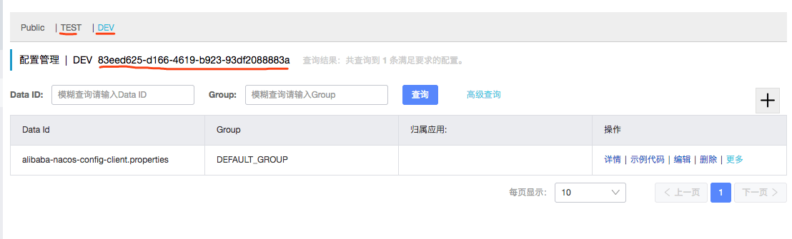

# nacos
## 构建应用接入Nacos注册中心

### 服务提供者

**第一步：**创建一个Spring Boot应用； 可以命名为：`alibaba-nacos-discovery-server` 

 **第二步**：编辑`pom.xml`，加入必要的依赖配置，比如： 

```xml
<parent>
    <groupId>org.springframework.boot</groupId>
    <artifactId>spring-boot-starter-parent</artifactId>
    <version>2.0.5.RELEASE</version>
    <relativePath/> <!-- lookup parent from repository -->
</parent>

<dependencyManagement>
    <dependencies>
        <dependency>
            <groupId>org.springframework.cloud</groupId>
            <artifactId>spring-cloud-dependencies</artifactId>
            <version>Finchley.SR1</version>
            <type>pom</type>
            <scope>import</scope>
        </dependency>
        <dependency>
            <groupId>org.springframework.cloud</groupId>
            <artifactId>spring-cloud-alibaba-dependencies</artifactId>
            <version>0.2.2.RELEASE</version>
            <type>pom</type>
            <scope>import</scope>
        </dependency>
    </dependencies>
</dependencyManagement>

<dependencies>
    <dependency>
        <groupId>org.springframework.boot</groupId>
        <artifactId>spring-boot-starter-web</artifactId>
    </dependency>
    <dependency>
        <groupId>org.springframework.cloud</groupId>
        <artifactId>spring-cloud-starter-alibaba-nacos-discovery</artifactId>
    </dependency>
    <dependency>
        <groupId>org.projectlombok</groupId>
        <artifactId>lombok</artifactId>
        <version>1.18.2</version>
        <optional>true</optional>
    </dependency>
</dependencies>
```

上述内容主要三部分：

- `parent`：定义spring boot的版本
- `dependencyManagement`：spring cloud的版本以及spring cloud alibaba的版本，由于spring cloud alibaba还未纳入spring cloud的主版本管理中，所以需要自己加入
- `dependencies`：当前应用要使用的依赖内容。这里主要新加入了Nacos的服务注册与发现模块：`spring-cloud-starter-alibaba-nacos-discovery`。由于在`dependencyManagement`中已经引入了版本，所以这里就不用指定具体版本了。


 **第三步**：创建应用主类，并实现一个HTTP接口： 

```java
@EnableDiscoveryClient
@SpringBootApplication
public class TestApplication {

    public static void main(String[] args) {
        SpringApplication.run(TestApplication.class, args);
    }

    @Slf4j
    @RestController
    static class TestController {
        @GetMapping("/hello")
        public String hello(@RequestParam String name) {
            log.info("invoked name = " + name);
            return "hello " + name;
        }
    }
}
```

 内容非常简单，`@SpringBootApplication`定义是个Spring Boot应用；`@EnableDiscoveryClient`开启Spring Cloud的服务注册与发现，由于这里引入了`spring-cloud-starter-alibaba-nacos-discovery`模块，所以Spring Cloud Common中定义的那些与服务治理相关的接口将使用Nacos的实现。这点不论我们使用Eureka、Consul还是其他Spring Cloud整合的注册中心都一样，这也是Spring Cloud做了封装的好处所在，如果对Eureka、Consul这些注册中心的整合还不熟悉的可以看看以前的这篇：[Spring Cloud构建微服务架构：服务注册与发现（Eureka、Consul）](http://blog.didispace.com/spring-cloud-starter-dalston-1/)。 

 **第四步**：配置服务名称和Nacos地址 

```properties
spring.application.name=alibaba-nacos-discovery-server
server.port=8001

spring.cloud.nacos.discovery.server-addr=127.0.0.1:8848
```

**第五步**：启动上面创建的应用。可以在启动时候增加`-Dserver.port=8001`的形式在本机的不同端口上启动多个实例。

在应用启动好之后，我们可以在控制台或日志中看到如下内容，代表已经注册成功：

```verilog
INFO 10476 --- [           main] o.s.c.a.n.registry.NacosServiceRegistry  : nacos registry, alibaba-nacos-discovery-server 10.123.18.216:8001 register finished
```

 在启动都ok之后，我们可以访问Nacos的管理页面http://127.0.0.1:8848/nacos/来查看服务列表，

### 服务消费者

接下来，实现一个应用来消费上面已经注册到Nacos的服务。

**第一步**：创建一个Spring Boot应用，命名为：`alibaba-nacos-discovery-client-common`。

**第二步**：编辑pom.xml中的依赖内容，与上面服务提供者的一样即可。

**第三步**：创建应用主类，并实现一个HTTP接口，在该接口中调用服务提供方的接口。

```java
@EnableDiscoveryClient
@SpringBootApplication
public class TestApplication {

    public static void main(String[] args) {
        SpringApplication.run(TestApplication.class, args);
    }

    @Slf4j
    @RestController
    static class TestController {

        @Autowired
        LoadBalancerClient loadBalancerClient;

        @GetMapping("/test")
        public String test() {
            // 通过spring cloud common中的负载均衡接口选取服务提供节点实现接口调用
            ServiceInstance serviceInstance = loadBalancerClient.choose("alibaba-nacos-discovery-server");
            String url = serviceInstance.getUri() + "/hello?name=" + "didi";
            RestTemplate restTemplate = new RestTemplate();
            String result = restTemplate.getForObject(url, String.class);
            return "Invoke : " + url + ", return : " + result;
        }
    }
}
```

 这里使用了Spring Cloud Common中的`LoadBalancerClient`接口来挑选服务实例信息。然后从挑选出的实例信息中获取可访问的URI，拼接上服务提供方的接口规则来发起调用。 

 **第四步**：配置服务名称和Nacos地址，让服务消费者可以发现上面已经注册到Nacos的服务。 

```properties
spring.application.name=alibaba-nacos-discovery-client-common
server.port=9000

spring.cloud.nacos.discovery.server-addr=127.0.0.1:8848
```


 **第五步**：启动服务消费者，然后通过curl或者postman等工具发起访问，下面以curl为例： 

```
$ curl localhost:9000/test
Invoke : http://10.123.18.216:8001/hello?name=didi, return : hello didi
$ curl localhost:9000/test
Invoke : http://10.123.18.216:8002/hello?name=didi, return : hello didi
```

 可以看到，两次不同请求的时候，真正实际调用的服务提供者实例是不同的，也就是说，通过`LoadBalancerClient`接口在获取服务实例的时候，已经实现了对服务提供方实例的负载均衡。但是很明显，这样的实现还是比较繁琐，预告下后面的几篇，关于服务消费的几种不同姿势。 


## 支持的几种服务消费方式

### 使用RestTemplate

在之前的例子中，已经使用过`RestTemplate`来向服务的某个具体实例发起HTTP请求，但是具体的请求路径是通过拼接完成的，对于开发体验并不好。但是，实际上，在Spring Cloud中对RestTemplate做了增强，只需要稍加配置，就能简化之前的调用方式。

比如：

```java
@EnableDiscoveryClient
@SpringBootApplication
public class TestApplication {

    public static void main(String[] args) {
        SpringApplication.run(TestApplication.class, args);
    }

    @Slf4j
    @RestController
    static class TestController {

        @Autowired
        RestTemplate restTemplate;

        @GetMapping("/test")
        public String test() {
            String result = restTemplate.getForObject("http://alibaba-nacos-discovery-server/hello?name=didi", String.class);
            return "Return : " + result;
        }
    }

    @Bean
    @LoadBalanced
    public RestTemplate restTemplate() {
        return new RestTemplate();
    }

}
```

 可以看到，在定义RestTemplate的时候，增加了`@LoadBalanced`注解，而在真正调用服务接口的时候，原来host部分是通过手工拼接ip和端口的，直接采用服务名的时候来写请求路径即可。在真正调用的时候，Spring Cloud会将请求拦截下来，然后通过负载均衡器选出节点，并替换服务名部分为具体的ip和端口，从而实现基于服务名的负载均衡调用。 


### 使用WebClient

 WebClient是Spring 5中最新引入的，可以将其理解为reactive版的RestTemplate。下面举个具体的例子，它将实现与上面RestTemplate一样的请求调用： 

```java
@EnableDiscoveryClient
@SpringBootApplication
public class TestApplication {

    public static void main(String[] args) {
        SpringApplication.run(TestApplication.class, args);
    }

    @Slf4j
    @RestController
    static class TestController {

        @Autowired
        private WebClient.Builder webClientBuilder;

        @GetMapping("/test")
        public Mono<String> test() {
            Mono<String> result = webClientBuilder.build()
                    .get()
                    .uri("http://alibaba-nacos-discovery-server/hello?name=didi")
                    .retrieve()
                    .bodyToMono(String.class);
            return result;
        }
    }

    @Bean
    @LoadBalanced
    public WebClient.Builder loadBalancedWebClientBuilder() {
        return WebClient.builder();
    }

}
```


### 使用Feign

上面介绍的RestTemplate和WebClient都是Spring自己封装的工具，下面介绍一个Netflix OSS中的成员，通过它可以更方便的定义和使用服务消费客户端。下面也举一个具体的例子，其实现内容与上面两种方式结果一致：

第一步：在`pom.xml`中增加openfeign的依赖：

```xml
<dependency>
    <groupId>org.springframework.cloud</groupId>
    <artifactId>spring-cloud-starter-openfeign</artifactId>
</dependency>
```

 第二步：定义Feign客户端和使用Feign客户端： 

```java
@EnableDiscoveryClient
@SpringBootApplication
@EnableFeignClients
public class TestApplication {

    public static void main(String[] args) {
        SpringApplication.run(TestApplication.class, args);
    }

    @Slf4j
    @RestController
    static class TestController {

        @Autowired
        Client client;

        @GetMapping("/test")
        public String test() {
            String result = client.hello("didi");
            return "Return : " + result;
        }
    }


    @FeignClient("alibaba-nacos-discovery-server")
    interface Client {

        @GetMapping("/hello")
        String hello(@RequestParam(name = "name") String name);

    }

}
```

 这里主要先通过`@EnableFeignClients`注解开启扫描Spring Cloud Feign客户端的功能；然后又创建一个Feign的客户端接口定义。使用`@FeignClient`注解来指定这个接口所要调用的服务名称，接口中定义的各个函数使用Spring MVC的注解就可以来绑定服务提供方的REST接口，比如下面就是绑定`alibaba-nacos-discovery-server`服务的`/hello`接口的例子。最后，在Controller中，注入了Client接口的实现，并调用hello方法来触发对服务提供方的调用。关于使用Feign的完整例子也可以通过在文末的仓库中查看。 


## 使用Nacos作为配置中心

### 创建配置

**第一步：**进入Nacos的控制页面，在配置列表功能页面中，点击右上角的“+”按钮，进入“新建配置”页面，如下图填写内容：

- `Data ID`：填入`alibaba-nacos-config-client.properties`
- `Group`：不修改，使用默认值`DEFAULT_GROUP`
- `配置格式`：选择`Properties`
- `配置内容`：应用要加载的配置内容，这里仅作为示例，做简单配置，比如：`didispace.title=spring-cloud-alibaba-learning`

### 创建应用

**第一步**：创建一个Spring Boot应用，可以命名为：`alibaba-nacos-config-client`。

**第二步**：编辑`pom.xml`，加入必要的依赖配置，比如：

```xml
<parent>
    <groupId>org.springframework.boot</groupId>
    <artifactId>spring-boot-starter-parent</artifactId>
    <version>2.0.5.RELEASE</version>
    <relativePath/> <!-- lookup parent from repository -->
</parent>

<dependencyManagement>
    <dependencies>
        <dependency>
            <groupId>org.springframework.cloud</groupId>
            <artifactId>spring-cloud-dependencies</artifactId>
            <version>Finchley.SR1</version>
            <type>pom</type>
            <scope>import</scope>
        </dependency>
        <dependency>
            <groupId>org.springframework.cloud</groupId>
            <artifactId>spring-cloud-alibaba-dependencies</artifactId>
            <version>0.2.2.RELEASE</version>
            <type>pom</type>
            <scope>import</scope>
        </dependency>
    </dependencies>
</dependencyManagement>

<dependencies>
    <dependency>
        <groupId>org.springframework.boot</groupId>
        <artifactId>spring-boot-starter-web</artifactId>
    </dependency>
    <dependency>
        <groupId>org.springframework.cloud</groupId>
        <artifactId>spring-cloud-starter-alibaba-nacos-config</artifactId>
    </dependency>
    <dependency>
        <groupId>org.projectlombok</groupId>
        <artifactId>lombok</artifactId>
        <version>1.18.2</version>
        <optional>true</optional>
    </dependency>
</dependencies>
```

上述内容主要三部分：

- `parent`：定义spring boot的版本
- `dependencyManagement`：spring cloud的版本以及spring cloud alibaba的版本，由于spring cloud alibaba还未纳入spring cloud的主版本管理中，所以需要自己加入
- `dependencies`：当前应用要使用的依赖内容。这里主要新加入了Nacos的配置客户端模块：`spring-cloud-starter-alibaba-nacos-config`。由于在`dependencyManagement`中已经引入了版本，所以这里就不用指定具体版本了。

 **第三步**：创建应用主类，并实现一个HTTP接口： 

```java
@SpringBootApplication
public class TestApplication {

    public static void main(String[] args) {
        SpringApplication.run(TestApplication.class, args);
    }

    @Slf4j
    @RestController
    @RefreshScope
    static class TestController {

        @Value("${didispace.title:}")
        private String title;

        @GetMapping("/test")
        public String hello() {
            return title;
        }

    }

}
```

内容非常简单，`@SpringBootApplication`定义是个Spring Boot应用；还定义了一个Controller，其中通过`@Value`注解，注入了key为`didispace.title`的配置（默认为空字符串），这个配置会通过`/test`接口返回，后续我们会通过这个接口来验证Nacos中配置的加载。另外，这里还有一个比较重要的注解`@RefreshScope`，主要用来让这个类下的配置内容支持动态刷新，也就是当我们的应用启动之后，修改了Nacos中的配置内容之后，这里也会马上生效。

**第四步**：创建配置文件`bootstrap.properties`，并配置服务名称和Nacos地址

```properties
spring.application.name=alibaba-nacos-config-client
server.port=8001

spring.cloud.nacos.config.server-addr=127.0.0.1:8848
```

 **注意**：这里必须使用`bootstrap.properties`。同时，`spring.application.name`值必须与上一阶段Nacos中创建的配置Data Id匹配（除了.properties或者.yaml后缀）。 

 **第五步**：启动上面创建的应用。 

```
2019-01-27 18:29:43.497  INFO 93597 --- [           main] o.s.c.a.n.c.NacosPropertySourceBuilder   : Loading nacos data, dataId: 'alibaba-nacos-config-client.properties', group: 'DEFAULT_GROUP'
2019-01-27 18:29:43.498  INFO 93597 --- [           main] b.c.PropertySourceBootstrapConfiguration : Located property source: CompositePropertySource {name='NACOS', propertySources=[NacosPropertySource {name='alibaba-nacos-config-client.properties'}]}

```

 在启动的时候，我们可以看到类似上面的日志信息，这里会输出应用程序要从Nacos中获取配置的dataId和group。如果在启动之后，发现配置信息没有获取到的时候，可以先从这里着手，看看配置加载的目标是否正确。 

**第六步**：验证配置获取和验证动态刷新

用curl或者postman等工具，访问接口: `localhost:8001/test`，一切正常的话，将返回Nacos中配置的`spring-cloud-alibaba-learning`。然后，再通过Nacos页面，修改这个内容，点击发布之后，再访问接口，可以看到返回结果变了。

同时，在应用的客户端，我们还能看到如下日志：

```
2019-01-27 18:39:14.162  INFO 93597 --- [-127.0.0.1_8848] o.s.c.e.event.RefreshEventListener       : Refresh keys changed: [didispace.title]
```

 在Nacos中修改了Key，在用到这个配置的应用中，也自动刷新了这个配置信息。 


## 加载规则

在[《Spring Cloud Alibaba基础教程：使用Nacos作为配置中心》](http://blog.didispace.com/spring-cloud-alibaba-3/)一文中，我们的例子完全采用了默认配置完成。所以，一起来看看Spring Cloud Alibaba Nacos模块默认情况下是如何加载配置信息的。

首先，回顾一下，我们在入门例子中，Nacos中创建的配置内容是这样的：

- `Data ID`：alibaba-nacos-config-client.properties
- `Group`：DEFAULT_GROUP

拆解一下，主要有三个元素，它们与具体应用的配置内容对应关系如下：

- Data ID中的`alibaba-nacos-config-client`：对应客户端的配置`spring.cloud.nacos.config.prefix`，默认值为`${spring.application.name}`，即：服务名
- Data ID中的`properties`：对应客户端的配置`spring.cloud.nacos.config.file-extension`，默认值为`properties`
- Group的值`DEFAULT_GROUP`：对应客户端的配置`spring.cloud.nacos.config.group`，默认值为`DEFAULT_GROUP`

在采用默认值的应用要加载的配置规则就是：`Data ID=${spring.application.name}.properties`，`Group=DEFAULT_GROUP`。

下面，我们做一些假设例子，方便大家理解这些配置之间的关系：

**例子一**：如果我们不想通过服务名来加载，那么可以增加如下配置，就会加载到`Data ID=example.properties`，`Group=DEFAULT_GROUP`的配置内容了：

```properties
spring.cloud.nacos.config.prefix=example
```

**例子二**：如果我们想要加载yaml格式的内容，而不是Properties格式的内容，那么可以通过如下配置，实现加载`Data ID=example.yaml`，`Group=DEFAULT_GROUP`的配置内容了：

```properties
spring.cloud.nacos.config.prefix=example
spring.cloud.nacos.config.file-extension=yaml
```

**例子三**：如果我们对配置做了分组管理，那么可以通过如下配置，实现加载`Data ID=example.yaml`，`Group=DEV_GROUP`的配置内容了：

```properties
spring.cloud.nacos.config.prefix=example
spring.cloud.nacos.config.file-extension=yaml
spring.cloud.nacos.config.group=DEV_GROUP
```

## 深入思考

上面，我们具体介绍了在Nacos中添加的各种配置与Spring Cloud应用中客户端配置的对照关系。对于`spring.cloud.nacos.config.prefix`和`spring.cloud.nacos.config.file-extension`来说，没有太多的花样可以去揣摩，大部分用户默认配置就可以使用，或者通过`spring.cloud.nacos.config.file-extension`修改下配置格式的后缀。

但是对于`spring.cloud.nacos.config.group`的配置来说，还是可以派一些特殊的作用，比如：用它来区分不同的产品组下各个应用的配置内容（解决可能应用名冲突的问题）、或者用它来区分不同用途的配置内容、再或者用它来区分不同环境的配置（Nacos下的配置纬度很多，我们可以通过不同的手段来实现多环境的配置，后面会专门写一篇如何实现多环境的配置）等。

如果您对`spring.cloud.nacos.config.group`还有什么其他妙用，欢迎留言分享您的使用方案。


## 多环境管理

在Nacos中，本身有多个不同管理级别的概念，包括：`Data ID`、`Group`、`Namespace`。只要利用好这些层级概念的关系，就可以根据自己的需要来实现多环境的管理。

下面，我就来介绍一下，可以使用的几种实现方式：

### 使用`Data ID`与`profiles`实现

`Data ID`在Nacos中，我们可以理解为就是一个Spring Cloud应用的配置文件名。我们知道默认情况下`Data ID`的名称格式是这样的：`${spring.application.name}.properties`，即：以Spring Cloud应用命名的properties文件。

实际上，`Data ID`的规则中，还包含了环境逻辑，这一点与Spring Cloud Config的设计类似。我们在应用启动时，可以通过`spring.profiles.active`来指定具体的环境名称，此时客户端就会把要获取配置的`Data ID`组织为：`${spring.application.name}-${spring.profiles.active}.properties`。

 实际上，更原始且最通用的匹配规则，是这样的：`${spring.cloud.nacos.config.prefix}`-`${spring.profile.active}`.`${spring.cloud.nacos.config.file-extension}`。而上面的结果是因为`${spring.cloud.nacos.config.prefix}`和`${spring.cloud.nacos.config.file-extension}`都使用了默认值。 

**动手试一试**


**第一步**：先在Nacos中，根据这个规则，创建两个不同环境的配置内容。比如：

  

如上图，我们为`alibaba-nacos-config-client`应用，定义了DEV和TEST的两个独立的环境配置。我们可以在里面定义不同的内容值，以便后续验证是否真实加载到了正确的配置。

**第二步**：在`alibaba-nacos-config-client`应用的配置文件中，增加环境配置：`spring.profiles.active=DEV`

**第三步**：启动应用，我们可以看到日志中打印了，加载的配置文件：

```
2019-01-30 15:25:18.216  INFO 96958 --- [           main] o.s.c.a.n.c.NacosPropertySourceBuilder   : Loading nacos data, dataId: 'alibaba-nacos-config-client-DEV.properties', group: 'DEFAULT_GROUP'
```


### 使用`Group`实现

`Group`在Nacos中是用来对`Data ID`做集合管理的重要概念。所以，如果我们把一个环境的配置视为一个集合，那么也就可以实现不同环境的配置管理。对于`Group`的用法并没有固定的规定，所以我们在实际使用的时候，需要根据我们的具体需求，可以是架构运维上对多环境的管理，也可以是业务上对不同模块的参数管理。为了避免冲突，我们需要在架构设计之初，做好一定的规划。这里，我们先来说说如何用`Group`来实现多环境配置管理的具体实现方式。

**动手试一试**

**第一步**：先在Nacos中，通过区分`Group`来创建两个不同环境的配置内容。比如：

  

如上图，我们为`alibaba-nacos-config-client`应用，定义了DEV环境和TEST环境的两个独立的配置，这两个匹配与上一种方法不同，它们的`Data ID`是完全相同的，只是`GROUP`不同。

**第二步**：在`alibaba-nacos-config-client`应用的配置文件中，增加`Group`的指定配置：`spring.cloud.nacos.config.group=DEV_GROUP`

**第三步**：启动应用，我们可以看到日志中打印了，加载的配置文件：

```
2019-01-30 15:55:23.718  INFO 3216 --- [main] o.s.c.a.n.c.NacosPropertySourceBuilder   : Loading nacos data, dataId: 'alibaba-nacos-config-client.properties', group: 'DEV_GROUP'
```


### 使用`Namespace`实现

`Namespace`在本系列教程中，应该还是第一次出现。先来看看官方的概念说明：用于进行租户粒度的配置隔离。不同的命名空间下，可以存在相同的`Group`或`Data ID`的配置。`Namespace`的常用场景之一是不同环境的配置的区分隔离，例如：开发测试环境和生产环境的资源（如配置、服务）隔离等。

在官方的介绍中，就介绍了利用其可以作为环境的隔离使用，下面我们就来试一下吧！

**动手试一试**

**第一步**：先在Nacos中，根据环境名称来创建多个`Namespace`。比如：

  

 **第二步**：在配置列表的最上方，可以看到除了`Public`之外，多了几个刚才创建的`Namepsace`。分别在`DEV`和`TEST`空间下为`alibaba-nacos-config-client`应用创建配置内容： 

  

 **第三步**：在`alibaba-nacos-config-client`应用的配置文件中，增加`Namespace`的指定配置，比如：`spring.cloud.nacos.config.namespace=83eed625-d166-4619-b923-93df2088883a`。 

 这里需要注意namespace的配置不是使用名称，而是使用Namespace的ID。 

 **第四步**：启动应用，通过访问`localhost:8001/test`接口，验证一下返回内容是否正确。这种方式下，目前版本的日志并不会输出与`Namespace`相关的信息，所以还无法以此作为加载内容的判断依据。 


## 深入思考

上面我们分别利用Nacos配置管理功能中的几个不同纬度来实现多环境的配置管理。从结果上而言，不论用哪一种方式，都能够胜任需求，但是哪一种最好呢？

**第一种**：通过`Data ID`与`profile`实现。

- *优点*：这种方式与Spring Cloud Config的实现非常像，用过Spring Cloud Config的用户，可以毫无违和感的过渡过来，由于命名规则类似，所以要从Spring Cloud Config中做迁移也非常简单。
- *缺点*：这种方式在项目与环境多的时候，配置内容就会显得非常混乱。配置列表中会看到各种不同应用，不同环境的配置交织在一起，非常不利于管理。
- *建议*：项目不多时使用，或者可以结合`Group`对项目根据业务或者组织架构做一些拆分规划。

**第二种**：通过`Group`实现。

- *优点*：通过`Group`按环境讲各个应用的配置隔离开。可以非常方便的利用`Data ID`和`Group`的搜索功能，分别从应用纬度和环境纬度来查看配置。
- *缺点*：由于会占用`Group`纬度，所以需要对`Group`的使用做好规划，毕竟与业务上的一些配置分组起冲突等问题。
- *建议*：这种方式虽然结构上比上一种更好一些，但是依然可能会有一些混乱，主要是在`Group`的管理上要做好规划和控制。

**第三种**：通过`Namespace`实现。

- *优点*：官方建议的方式，通过`Namespace`来区分不同的环境，释放了`Group`的自由度，这样可以让`Group`的使用专注于做业务层面的分组管理。同时，Nacos控制页面上对于`Namespace`也做了分组展示，不需要搜索，就可以隔离开不同的环境配置，非常易用。

- *缺点*：没有啥缺点，可能就是多引入一个概念，需要用户去理解吧。

- *建议*：直接用这种方式长远上来说会比较省心。虽然可能对小团队而言，项目不多，第一第二方式也够了，但是万一后面做大了呢？

  

 注意：不论用哪一种方式实现。对于指定环境的配置（`spring.profiles.active=DEV`、`spring.cloud.nacos.config.group=DEV_GROUP`、`spring.cloud.nacos.config.namespace=83eed625-d166-4619-b923-93df2088883a`），都不要配置在应用的`bootstrap.properties`中。而是在发布脚本的启动命令中，用`-Dspring.profiles.active=DEV`的方式来动态指定，会更加灵活！。 


## Nacos配置的多文件加载与共享配置

但是，我们实际应用过程中还会经常碰到这样的问题：有时候我们会对应用的配置根据具体作用做一些拆分，存储在不同的配置文件中，除了归类不同的配置之外，也可以便于共享配置给不同的应用。对于这样的需求，Nacos也可以很好的支持，下面就来具体介绍一下，当使用Nacos时，我们如何加载多个配置，以及如何共享配置。

### 加载多个配置

通过之前的学习，我们已经知道Spring应用对Nacos中配置内容的对应关系是通过下面三个参数控制的：

- spring.cloud.nacos.config.prefix
- spring.cloud.nacos.config.file-extension
- spring.cloud.nacos.config.group

默认情况下，会加载`Data ID=${spring.application.name}.properties`，`Group=DEFAULT_GROUP`的配置。

假设现在有这样的一个需求：我们想要对所有应用的Actuator模块以及日志输出做统一的配置管理。所以，我们希望可以将Actuator模块的配置放在独立的配置文件`actuator.properties`文件中，而对于日志输出的配置放在独立的配置文件`log.properties`文件中。通过拆分这两类配置内容，希望可以做到配置的共享加载与统一管理。

这时候，我们只需要做以下两步，就可以实现这个需求：

**第一步**：在Nacos中创建`Data ID=actuator.properties`，`Group=DEFAULT_GROUP`和`Data ID=log.properties`，`Group=DEFAULT_GROUP`的配置内容。

  

**第二步**：在Spring Cloud应用中通过使用`spring.cloud.nacos.config.ext-config`参数来配置要加载的这两个配置内容，比如：

```properties
spring.cloud.nacos.config.ext-config[0].data-id=actuator.properties
spring.cloud.nacos.config.ext-config[0].group=DEFAULT_GROUP
spring.cloud.nacos.config.ext-config[0].refresh=true
spring.cloud.nacos.config.ext-config[1].data-id=log.properties
spring.cloud.nacos.config.ext-config[1].group=DEFAULT_GROUP
spring.cloud.nacos.config.ext-config[1].refresh=true
```

可以看到，`spring.cloud.nacos.config.ext-config`配置是一个数组List类型。每个配置中包含三个参数：`data-id`、`group`，`refresh`；前两个不做赘述，与Nacos中创建的配置相互对应，`refresh`参数控制这个配置文件中的内容时候支持自动刷新，默认情况下，只有默认加载的配置才会自动刷新，对于这些扩展的配置加载内容需要配置该设置时候才会实现自动刷新。


### 共享配置

通过上面加载多个配置的实现，实际上我们已经可以实现不同应用共享配置了。但是Nacos中还提供了另外一个便捷的配置方式，比如下面的设置与上面使用的配置内容是等价的：

```properties
spring.cloud.nacos.config.shared-dataids=actuator.properties,log.properties
spring.cloud.nacos.config.refreshable-dataids=actuator.properties,log.properties
```

- `spring.cloud.nacos.config.shared-dataids`参数用来配置多个共享配置的`Data Id`，多个的时候用用逗号分隔
- `spring.cloud.nacos.config.refreshable-dataids`参数用来定义哪些共享配置的`Data Id`在配置变化时，应用中可以动态刷新，多个`Data Id`之间用逗号隔开。如果没有明确配置，默认情况下所有共享配置都不支持动态刷新

### 配置加载的优先级

当我们加载多个配置的时候，如果存在相同的key时，我们需要深入了解配置加载的优先级关系。

在使用Nacos配置的时候，主要有以下三类配置：

- A: 通过`spring.cloud.nacos.config.shared-dataids`定义的共享配置
- B: 通过`spring.cloud.nacos.config.ext-config[n]`定义的加载配置
- C: 通过内部规则（`spring.cloud.nacos.config.prefix`、`spring.cloud.nacos.config.file-extension`、`spring.cloud.nacos.config.group`这几个参数）拼接出来的配置

要弄清楚这几个配置加载的顺序，我们从日志中也可以很清晰的看到，我们可以做一个简单的实验：

```properties
spring.cloud.nacos.config.ext-config[0].data-id=actuator.properties
spring.cloud.nacos.config.ext-config[0].group=DEFAULT_GROUP
spring.cloud.nacos.config.ext-config[0].refresh=true

spring.cloud.nacos.config.shared-dataids=log.properties
spring.cloud.nacos.config.refreshable-dataids=log.properties
```

 根据上面的配置，应用分别会去加载三类不同的配置文件，启动应用的时候，将会在日志中看到如下输出： 

```
2019-02-08 21:23:02.665  INFO 63804 --- [main] o.s.c.a.n.c.NacosPropertySourceBuilder   : Loading nacos data, dataId: 'log.properties', group: 'DEFAULT_GROUP'
2019-02-08 21:23:02.671  INFO 63804 --- [main] o.s.c.a.n.c.NacosPropertySourceBuilder   : Loading nacos data, dataId: 'actuator.properties', group: 'DEFAULT_GROUP'
2019-02-08 21:23:02.677  INFO 63804 --- [main] o.s.c.a.n.c.NacosPropertySourceBuilder   : Loading nacos data, dataId: 'alibaba-nacos-config-client.properties', group: 'DEFAULT_GROUP'
```

 后面加载的配置会覆盖之前加载的配置，所以优先级关系是：`A < B < C` 